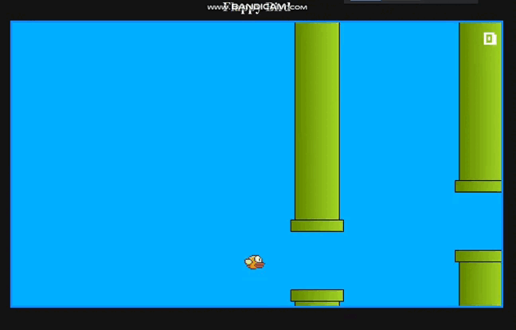

<h1 align="center"> Flappy Bird </h>

<h2> Projeto Flappy bird desenvolvido no curso de javascript web moderno realizado pela Cod3r </h2>

<h2>
<a href="#tecnologia">Tecnologias</a>&nbsp;&nbsp;&nbsp;|&nbsp;&nbsp;&nbsp;
<a href="#tecnologia">Projetos</a>&nbsp;&nbsp;&nbsp;|&nbsp;&nbsp;&nbsp;
 <a href="#memo-tecnologia">licença</a>
</h2>

 

  

## 🖥️ Projeto

Projeto Flappy Bird e um jogo que tem como objetivo controlar um passaro entre os obstaculos com o intuito de fazer o maximo de pontos possível.

- [📌Acesse o projeto finalizado, online](https://jeferson-3.github.io/Projeto_Flappy_Bird/)

 
 

## 🤖 Tecnologias

<h3>Esse projeto foi desenvolvido com as seguintes tecnologias</h3>
 

- HTML
- CSS
- JavaScript | DOM
- Git/Github

## :memo: Licença
Essa licença esta sob a licença MIT
